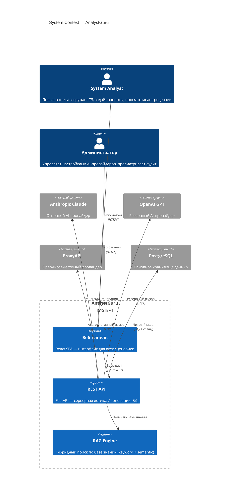
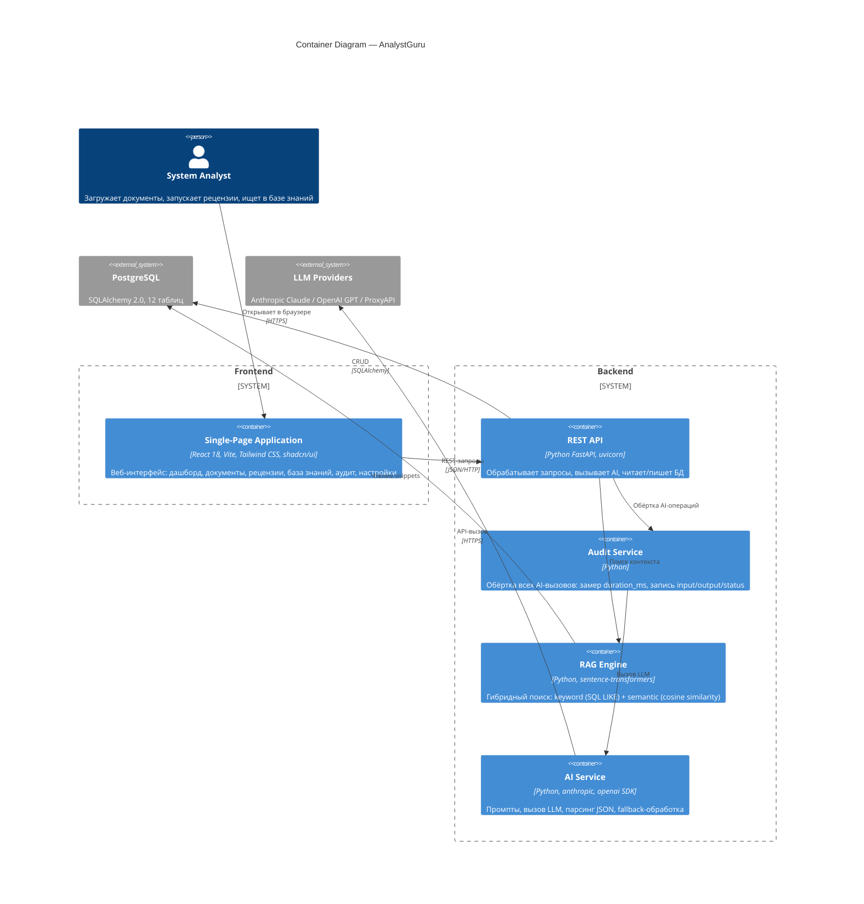
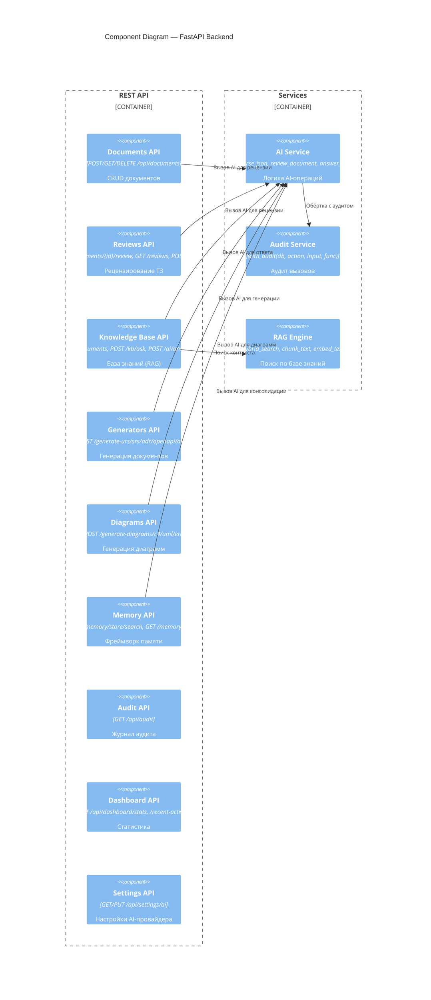
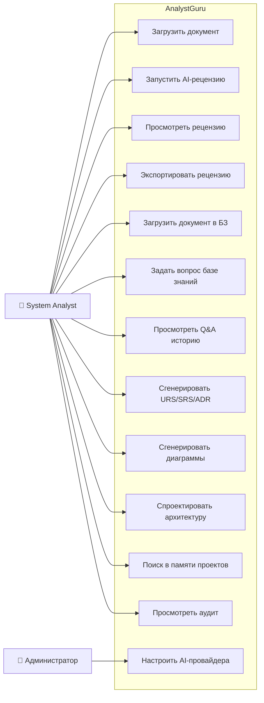
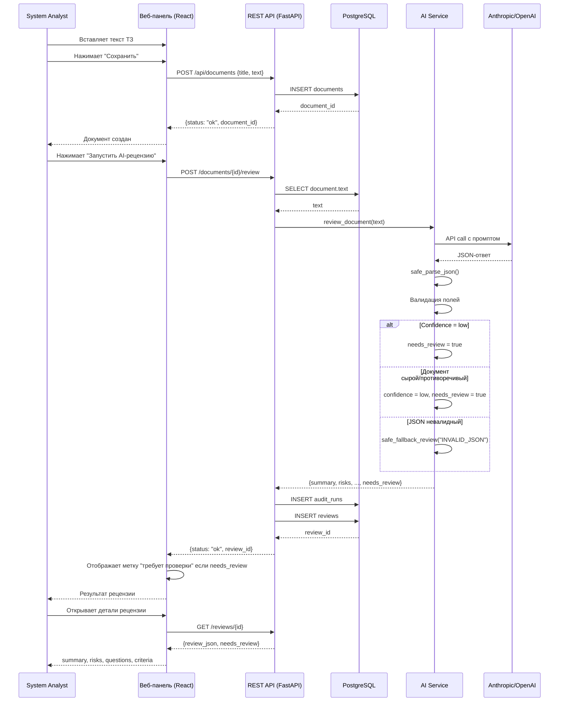

# AnalystGuru

**AI System Analyst Copilot** — рабочий стол Lead System Analyst / Solution Architect.

Автоматизирует рецензирование технических заданий, управление базой знаний (RAG), генерацию проектной документации (URS/SRS/ADR/OpenAPI/диаграммы), фреймворк памяти по проектам и центр аудита.

---

## Содержание

- [Архитектура](#архитектура)
  - [C4 — Context (Контекст системы)](#c4--контекст-системы)
  - [C4 — Container (Контейнеры)](#c4--контейнеры)
  - [C4 — Component (Компоненты API)](#c4--компоненты-api)
- [Стек технологий](#стек-технологий)
- [Модель данных](#модель-данных)
  - [UML — Class Diagram](#uml--class-diagram)
- [Сценарии использования](#сценарии-использования)
  - [UML — Use Case Diagram](#uml--use-case-diagram)
  - [UML — Sequence Diagram (рецензия документа)](#uml--sequence-diagram-рецензия-документа)
- [API endpoints](#api-endpoints)
- [Запуск проекта](#запуск-проекта)
- [Переменные окружения](#переменные-окружения)
- [Структура проекта](#структура-проекта)
- [Контроль качества](#контроль-качества)

---

## Архитектура

### C4 — Контекст системы



### C4 — Контейнеры



### C4 — Компоненты API



---

## Стек технологий

| Компонент | Технология |
|-----------|-----------|
| **Фронтенд** | React 18, TypeScript 5.9, Vite 7, Tailwind CSS 4, shadcn/ui, TanStack Query 5, Wouter |
| **Бэкенд** | Python 3.11, FastAPI, uvicorn |
| **ORM** | SQLAlchemy 2.0 |
| **База данных** | PostgreSQL (SQLAlchemy), SQLite-совместимый DDL |
| **AI-провайдеры** | Anthropic Claude 3.5 Sonnet (основной), OpenAI GPT-4o (резервный), ProxyAPI (OpenAI-совместимый) |
| **RAG** | Гибридный поиск: keyword (SQL LIKE) + semantic (sentence-transformers, опционально) |
| **Монорепозиторий** | pnpm workspaces, npm catalog |
| **Генерация кода API** | Orval (OpenAPI → React Query hooks + Zod schemas) |
| **Сборка** | TypeScript 5.9, esbuild 0.27 |

---

## Модель данных

### UML — Class Diagram

```mermaid
classDiagram
  class Document {
    +String id
    +DateTime created_at
    +String title
    +String text
    +String doc_type
    +String project_name
    +Boolean is_kb
  }

  class Snippet {
    +String id
    +DateTime created_at
    +String document_id
    +String snippet_text
    +String embedding
  }

  class Review {
    +String id
    +DateTime created_at
    +String document_id
    +String review_json
    +Boolean needs_review
    +String confidence
    +String error
  }

  class QARun {
    +String id
    +DateTime created_at
    +String question
    +String answer
    +String sources_json
    +Boolean needs_review
    +String error
  }

  class AuditRun {
    +String id
    +DateTime created_at
    +String action
    +String input
    +String output
    +String status
    +String error
    +Integer duration_ms
  }

  class MemoryItem {
    +String id
    +DateTime created_at
    +String memory_type
    +String content
    +String tags
    +String project_name
    +Float relevance_score
  }

  class ArchitectureReview {
    +String id
    +DateTime created_at
    +String document_id
    +String recommendation_json
    +Boolean needs_review
  }

  class APISpec {
    +String id
    +DateTime created_at
    +String document_id
    +String openapi_json
    +String openapi_yaml
  }

  class ADRRecord {
    +String id
    +DateTime created_at
    +String document_id
    +String adr_json
    +Boolean needs_review
    +String confidence
  }

  class DiagramArtifact {
    +String id
    +DateTime created_at
    +String document_id
    +String diagram_type
    +String notation
    +String source_code
    +Boolean needs_review
  }

  class GeneratedDoc {
    +String id
    +DateTime created_at
    +String document_id
    +String content_type
    +String content
    +Boolean needs_review
    +String confidence
  }

  class AiSetting {
    +String id
    +DateTime created_at
    +DateTime updated_at
    +String provider
    +String api_key
  }

  class RiskCatalogItem {
    +String id
    +DateTime created_at
    +String severity
    +String category
    +String description
    +String mitigation
    +String project_context
  }

  class ProjectLesson {
    +String id
    +DateTime created_at
    +String project_name
    +String lesson
    +String impact
    +String tags
  }

  class Decision {
    +String id
    +DateTime created_at
    +String document_id
    +String context
    +String problem
    +String decision
    +String alternatives
    +String consequences
    +String status
  }

  Document "1" --> "*" Snippet : имеет
  Document "1" --> "*" Review : имеет
  Document "1" --> "*" ArchitectureReview : имеет
  Document "1" --> "*" APISpec : имеет
  Document "1" --> "*" ADRRecord : имеет
  Document "1" --> "*" DiagramArtifact : имеет
  Document "1" --> "*" GeneratedDoc : имеет
  Document "1" --> "*" Decision : имеет
```



---

## Сценарии использования

### UML — Use Case Diagram



### UML — Sequence Diagram (рецензия документа)



---

## API endpoints

### Управление документами
| Метод | Путь | Назначение |
|-------|------|-----------|
| `POST` | `/api/documents` | Создать документ |
| `GET` | `/api/documents` | Список документов |
| `GET` | `/api/documents/{id}` | Детали документа |
| `DELETE` | `/api/documents/{id}` | Удалить документ |

### AI-рецензии
| Метод | Путь | Назначение |
|-------|------|-----------|
| `POST` | `/documents/{id}/review` | Запустить рецензию |
| `GET` | `/reviews` | Список рецензий |
| `GET` | `/reviews/{id}` | Детали рецензии |
| `POST` | `/ai/review` | AI-рецензия (direct) |

### База знаний (RAG)
| Метод | Путь | Назначение |
|-------|------|-----------|
| `POST` | `/kb/documents` | Добавить документ в БЗ |
| `GET` | `/kb/documents` | Список документов БЗ |
| `POST` | `/kb/ask` | Задать вопрос |
| `POST` | `/ai/answer_with_sources` | AI-ответ с источниками |
| `GET` | `/kb/history` | История Q&A |

### Генерация документов
| Метод | Путь | Назначение |
|-------|------|-----------|
| `POST` | `/documents/{id}/generate-urs` | URS |
| `POST` | `/documents/{id}/generate-srs` | SRS |
| `POST` | `/documents/{id}/generate-adr` | ADR |
| `POST` | `/documents/{id}/design-api` | OpenAPI |
| `POST` | `/documents/{id}/recommend-architecture` | Архитектура |
| `POST` | `/documents/{id}/export/docx` | Экспорт DOCX |

### Диаграммы
| Метод | Путь | Назначение |
|-------|------|-----------|
| `POST` | `/documents/{id}/generate-diagrams` | Все диаграммы |
| `GET` | `/api/diagrams/{id}` | Получить диаграмму |
| `POST` | `/api/diagrams/generate-c4` | C4 |
| `POST` | `/api/diagrams/generate-uml` | UML |
| `POST` | `/api/diagrams/generate-erd` | ERD |

### Аудит, память, настройки, экспорт
| Метод | Путь | Назначение |
|-------|------|-----------|
| `GET` | `/api/audit` | Журнал аудита (фильтры: action, status) |
| `GET` | `/api/dashboard/stats` | Статистика |
| `GET` | `/api/dashboard/recent-activity` | Последние операции |
| `POST` | `/api/memory/store` | Сохранить в память |
| `POST` | `/api/memory/search` | Поиск в памяти |
| `GET` | `/api/memory/recent` | Последние записи памяти |
| `POST` | `/api/memory/consolidate` | Консолидация памяти |
| `GET` | `/api/settings/ai` | Получить настройки AI |
| `PUT` | `/api/settings/ai` | Сохранить настройки AI |
| `GET` | `/reviews/{id}/export/json` | Экспорт рецензии в JSON |
| `GET` | `/reviews/{id}/export/csv` | Экспорт рецензии в CSV |
| `GET` | `/documents/{id}/export/docx` | Экспорт документа в DOCX |

---

## Запуск проекта

### Предварительные требования

- Node.js ≥ 20
- pnpm ≥ 10
- Python ≥ 3.11
- PostgreSQL или SQLite

### Запуск через Docker (рекомендуется)

```bash
# 1. Клонировать репозиторий
git clone <repo> && cd analyst-guru

# 2. Настройка переменных окружения
cp .env.example .env
# Отредактируйте .env, укажите DATABASE_URL и хотя бы один API-ключ

# 3. Запуск
docker compose up --build
```

Фронтенд будет доступен по адресу `http://localhost:5173`, API — `http://localhost:8080`.

### Запуск без Docker

```bash
# 1. Установка зависимостей Node.js
pnpm install

# 2. Установка зависимостей Python
pip install -r artifacts/api-server/requirements.txt

# 3. Настройка переменных окружения
cp .env.example .env
# Отредактируйте .env, укажите DATABASE_URL и API-ключи

# 4. Запуск API-сервера
python artifacts/api-server/run.py

# 5. Запуск фронтенда (в отдельном терминале)
pnpm --filter @workspace/analyst-guru run dev
```

### Запуск тестов

```bash
cd artifacts/api-server
pip install -r requirements.txt
DATABASE_URL=sqlite:///./test.db python -m pytest tests/ -v
```

### Миграции базы данных (Alembic)

```bash
cd artifacts/api-server
alembic revision --autogenerate -m "описание изменений"
alembic upgrade head
```

### Примеры запросов

```bash
# Создать документ
curl -X POST http://localhost:8080/api/documents \
  -H "Content-Type: application/json" \
  -d '{"title":"Форма заявки","text":"Нужна форма заявки с таблицей результатов. Поля: имя, телефон."}'

# Запустить рецензию (замените DOCUMENT_ID)
curl -X POST http://localhost:8080/api/documents/DOCUMENT_ID/review

# Запустить рецензию с Chain-of-Thought
curl -X POST "http://localhost:8080/api/documents/DOCUMENT_ID/review?reasoning_mode=cot"

# Запустить рецензию с ReAct (рассуждение + самопроверка)
curl -X POST "http://localhost:8080/api/documents/DOCUMENT_ID/review?reasoning_mode=react"

# Посмотреть рецензию
curl -X GET http://localhost:8080/api/reviews/REVIEW_ID

# Прямой AI-анализ текста (без сохранения документа)
curl -X POST http://localhost:8080/api/ai/review \
  -H "Content-Type: application/json" \
  -d '{"text":"Нужна форма заявки с таблицей результатов. Поля: имя, телефон, email."}'

# Прямой AI-анализ с CoT
curl -X POST http://localhost:8080/api/ai/review \
  -H "Content-Type: application/json" \
  -d '{"text":"Нужна форма заявки...","reasoning_mode":"cot"}'

# Добавить документ в базу знаний
curl -X POST http://localhost:8080/api/kb/documents \
  -H "Content-Type: application/json" \
  -d '{"title":"Правила работы","text":"Стандарты и регламенты команды.\n1. Стендап в 10:00.\n2. Код-ревью обязательно."}'

# Задать вопрос базе знаний (без рассуждений)
curl -X POST http://localhost:8080/api/kb/ask \
  -H "Content-Type: application/json" \
  -d '{"question":"Какой механизм аутентификации используется?"}'

# Задать вопрос с CoT
curl -X POST http://localhost:8080/api/kb/ask \
  -H "Content-Type: application/json" \
  -d '{"question":"Какой механизм аутентификации используется?","reasoning_mode":"cot"}'

# Прямой AI-ответ с источниками (для тестирования)
curl -X POST http://localhost:8080/api/ai/answer_with_sources \
  -H "Content-Type: application/json" \
  -d '{"question":"Что такое ADR?","context":"ADR (Architecture Decision Record) — это запись об архитектурном решении."}'
```

---

### Chain-of-Thought и ReAct (опционально)

По умолчанию ИИ отвечает напрямую, без пояснения хода рассуждений. Для сложных случаев можно включить режимы:

| Режим | Параметр | Описание |
|-------|----------|----------|
| Без рассуждений | `"none"` | Прямой ответ, только JSON (по умолчанию) |
| Chain-of-Thought | `"cot"` | ИИ пошагово анализирует задачу перед ответом, рассуждения сохраняются в поле `reasoning` |
| ReAct | `"react"` | ИИ использует цикл «рассуждение → действие → наблюдение → проверка», результат с самопроверкой |

**Где поддерживается:**
- `POST /api/documents/{id}/review?reasoning_mode=cot` — рецензия с CoT
- `POST /api/ai/review` — поле `"reasoning_mode": "cot"` в теле запроса
- `POST /api/kb/ask` — поле `"reasoning_mode": "react"` в теле запроса
- `POST /api/ai/answer_with_sources` — поле `"reasoning_mode": "cot"` в теле запроса

В веб-панели режим выбирается через выпадающий список рядом с кнопкой «Рецензировать» или «Спросить».
При использовании CoT или ReAct ответ содержит дополнительный блок `reasoning` с цепочкой рассуждений.

---

## Переменные окружения

| Переменная | Обязательная | По умолчанию | Описание |
|-----------|-------------|-------------|----------|
| `DATABASE_URL` | **Да** | — | Postgres или SQLite connection string |
| `ANTHROPIC_API_KEY` | Нет | — | Ключ Anthropic Claude |
| `OPENAI_API_KEY` | Нет | — | Ключ OpenAI GPT |
| `PROXYAPI_API_KEY` | Нет | — | Ключ ProxyAPI |
| `PROXYAPI_BASE_URL` | Нет | `https://api.proxyapi.ru/openai/v1` | Базовый URL ProxyAPI |
| `OPENROUTER_API_KEY` | Нет | — | Ключ OpenRouter |
| `OPENROUTER_BASE_URL` | Нет | `https://openrouter.ai/api/v1` | Базовый URL OpenRouter |
| `LLM_PROVIDER` | Нет | `openrouter` | Провайдер по умолчанию (`openrouter`, `anthropic`, `openai`, `proxyapi`) |
| `LLM_TEMPERATURE` | Нет | `0.2` | Температура LLM |
| `LLM_MAX_TOKENS` | Нет | `4096` | Максимум токенов |
| `RAG_TOP_K` | Нет | `5` | Количество фрагментов в RAG-поиске |
| `APP_SECRET_KEY` | Нет | `change_me_in_production` | Секретный ключ приложения |
| `PORT` | Нет | `8080` | Порт API-сервера |

Настройки AI-провайдера и API-ключ также можно изменить через веб-интерфейс (Settings → AI Provider), без перезапуска сервера.

---

## Структура проекта

```
analyst-guru/
├── artifacts/
│   ├── analyst-guru/              # React + Vite фронтенд
│   │   ├── Dockerfile             # Контейнер фронтенда
│   │   └── src/
│   │       ├── components/        # UI-компоненты (shadcn/ui)
│   │       ├── pages/             # Страницы приложения (11 шт.)
│   │       ├── lib/               # i18n, утилиты
│   │       └── hooks/             # Кастомные хуки
│   ├── api-server/                # Python FastAPI бэкенд
│   │   ├── Dockerfile             # Контейнер бэкенда
│   │   ├── requirements.txt       # Python-зависимости
│   │   ├── run.py                 # Точка входа uvicorn
│   │   ├── alembic.ini            # Конфигурация миграций
│   │   ├── alembic/               # Alembic миграции
│   │   │   ├── env.py
│   │   │   ├── script.py.mako
│   │   │   └── versions/
│   │   ├── tests/                 # pytest тесты (22 теста)
│   │   │   ├── conftest.py
│   │   │   ├── test_documents.py
│   │   │   ├── test_reviews.py
│   │   │   ├── test_kb.py
│   │   │   ├── test_audit.py
│   │   │   └── test_dashboard.py
│   │   └── backend/
│   │       ├── api/               # Роутеры (10 модулей)
│   │       ├── services/          # AI, RAG, Audit сервисы
│   │       ├── main.py            # Точка входа FastAPI
│   │       ├── models.py          # SQLAlchemy модели (15)
│   │       └── database.py        # Подключение к БД
│   └── mockup-sandbox/            # Песочница компонентов
├── lib/
│   ├── api-spec/                  # OpenAPI 3.1 спецификация
│   ├── api-client-react/          # Сгенерированные React Query хуки
│   ├── api-zod/                   # Сгенерированные Zod схемы
│   └── db/                        # Drizzle ORM схемы
├── scripts/                       # Вспомогательные скрипты
├── tests_data/
│   ├── specs/specs.jsonl          # 10 ТЗ для AI-рецензента
│   ├── kb_documents.jsonl         # 5 документов для базы знаний
│   ├── kb_questions.jsonl         # 10 вопросов (7 с ответом, 3 без)
│   └── README_tests.md            # Таблица ожидаемых результатов
├── .env.example                   # Пример переменных окружения
├── docker-compose.yml             # Docker Compose (backend + frontend)
├── pnpm-workspace.yaml            # Конфигурация монорепозитория
└── ARCHITECTURE.md                # Архитектурная документация
```

---

## Контроль качества

### Pydantic-валидация

Все AI-операции проходят двухуровневую валидацию:

1. **Входные данные** — Pydantic `BaseModel` на каждом эндпоинте (валидация длины текста, типов полей)
2. **Выходные данные LLM** — Pydantic-схемы (`ReviewOutput`, `AnswerOutput`, `ArchitectureOutput`, `ADROutput`, `DocGenOutput`, `OpenAPIOutput`, `DiagramOutput`) для каждого типа AI-операции. Если LLM возвращает невалидный JSON — срабатывает `safe_fallback` с `needs_review=true`.

### Миграции (Alembic)

Для управления схемой БД используется Alembic. Первая миграция создаётся командой:
```bash
cd artifacts/api-server
alembic revision --autogenerate -m "initial"
alembic upgrade head
```

### Тестовые данные

Папка `tests_data/` содержит 10 тестовых ТЗ (4 из них должны возвращать `needs_review=true`), 5 документов базы знаний и 10 вопросов (3 должны возвращать `needs_review=true`).

### Ручная проверка (`needs_review`)

Система честно сообщает, когда не уверена в результате:

| Условие | `confidence` | `needs_review` | Причина в audit |
|---------|-------------|----------------|-----------------|
| Всё хорошо | `high`/`medium` | `false` | — |
| Документ сырой (1-3 строки) | `low` | `true` | `TOO_VAGUE_INPUT` |
| Противоречивые требования | `low` | `true` | `CONTRADICTORY_INPUT` |
| LLM вернул невалидный JSON | `low` | `true` | `INVALID_JSON` |
| Нет источников в RAG | `low` | `true` | `NO_SOURCES_FOUND` |
| Низкая уверенность LLM | `low` | `true` | `LOW_CONFIDENCE` |

### Воспроизведение ручной проверки

Запустите тесты для проверки сценариев, требующих ручной проверки:

```bash
cd artifacts/api-server
DATABASE_URL=sqlite:///./test.db python -m pytest tests/ \
  tests/test_documents.py tests/test_reviews.py tests/test_kb.py \
  tests/test_audit.py tests/test_dashboard.py -v
```

Тестовые данные `tests_data/specs/specs.jsonl` содержат 4 ТЗ, ожидаемо возвращающих `needs_review=true` (короткие и противоречивые требования). При запуске тестов с mock'ами LLM эти сценарии проверяются без вызова реальной модели.

### Аудит

Каждый AI-вызов фиксируется в таблице `audit_runs`:
- `action` — тип операции (`review_document`, `answer_with_sources`, `generate_urs`, ...)
- `input` — входные данные (текст документа, вопрос)
- `output` — результат (JSON-ответ)
- `status` — `ok` / `error` / `needs_review`
- `error` — причина ошибки или код ручной проверки
- `duration_ms` — время выполнения
- `created_at` — временная метка

Просмотр журнала аудита через API: `GET /api/audit`. База данных SQLite по умолчанию сохраняется в `./data/analyst_guru.db` (путь задаётся в `DATABASE_URL`).

---

## Мини-экономика (на 100 операций)

| Параметр | Без системы | С AnalystGuru |
|----------|------------|---------------|
| Время на 1 рецензию | 30-60 мин | 2-3 мин |
| Время на 100 рецензий | 50-100 ч | 3-5 ч |
| Стоимость AI (100 опер.) | — | ~$3-5 (Claude) |
| Экономия времени | — | **~90%** |
